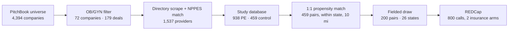
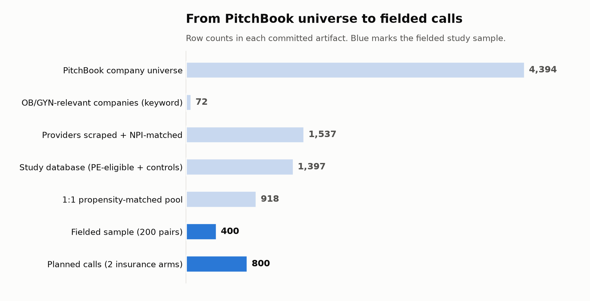
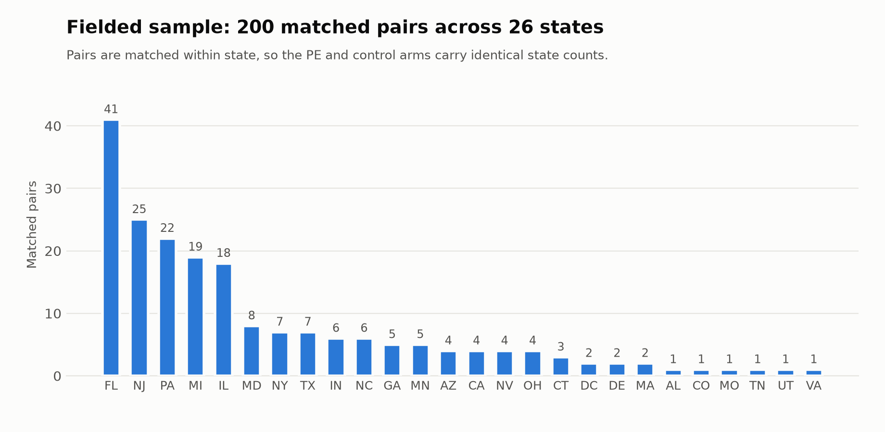
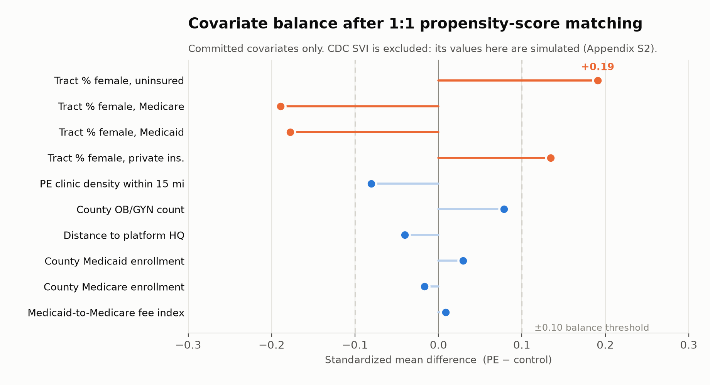

# private_equity

[](https://github.com/mufflyt/private_equity/actions/workflows/gates.yml)
[](SAP.lock)
[](NEWS.md)
[](docs/CANONICAL_SOURCES_AUDIT.md)

*Building and defending the sampling frame for a national mystery-caller study of **400 OB/GYN clinicians in 200 within-state matched pairs across 26 states**, asking whether private-equity ownership changes how long a new patient waits for an appointment — and whether that penalty falls harder on Medicaid.*

**[→ Frozen statistical analysis plan](SAP.lock)**
&nbsp;·&nbsp; [Analysis gates](R/analysis_gates.R)
&nbsp;·&nbsp; [Canonical sources audit](docs/CANONICAL_SOURCES_AUDIT.md)
&nbsp;·&nbsp; [Manuscript](manuscript/)



| Stage | Result |
|---|---|
| PitchBook company / deal universe | 4,394 companies, 5,664 deals scraped |
| OB/GYN-relevant PE universe | 72 companies, 179 deals after keyword filter and manual de-noising |
| Provider directories → NPI | 1,537 clinicians matched to CMS NPPES, MD/DO enforced, mid-levels excluded |
| Study database | 1,397 clinicians (938 PE-eligible, 459 controls), 62 columns |
| Propensity-score matched pool | 459 pairs (918 clinicians), 1:1, same state, 10-mile caliper |
| **Fielded sample** | **200 pairs · 400 clinicians · 26 states · 398 distinct practice lines** |
| **Planned calls** | **800** (each clinician called once as Medicaid, once as Blue Cross/Blue Shield) |
| Expected analytic n | ~622 completed calls; the identifying interaction cell falls to ~82 |

> **The outcome data does not exist yet.** Calls are collected separately in REDCap. Every
> figure and number in this README describes the *design and the sampling frame*, not results.
> Nothing here is a finding about wait times.

## Figures

All three are rebuilt from committed artifacts by `make_readme_figures.py`. No simulated
column is plotted anywhere in them.

### 1. From PitchBook universe to fielded calls

*Figure 1: Row counts in each committed pipeline artifact. Two orders of magnitude separate the scraped universe from the 400 clinicians who will actually be called.*

### 2. Geographic distribution of the fielded sample

*Figure 2: 200 matched pairs across 26 states. Matching is within state, so the PE and control arms carry identical state counts by construction. Florida (41 pairs) remains the largest market even after the round-robin cap.*

### 3. Covariate balance after matching

*Figure 3: Standardized mean differences on the committed covariates. County- and platform-level covariates balance well; the four census-tract payer-mix measures exceed ±0.10, which is what the pair random effect and the frozen covariate set are there to absorb. CDC SVI is **excluded from this figure** — see [Known issues](#known-issues).*

## What the study asks

A cross-sectional **mystery-caller** design. Trained callers pose as new patients and request
the first available new-patient appointment, twice per clinician: once presenting Medicaid,
once presenting Blue Cross/Blue Shield. The comparison is private-equity-backed practices
against independent practices matched within the same state and local market.

Two outcomes, both pre-specified:

- **Obtainment** — was an appointment obtained at all? PE vs independent, Medicaid calls only.
- **Wait time** — business days to the first available appointment, and specifically whether
  the PE penalty differs by insurance (the `pe × medicaid` interaction).

COMIRB exempt. PI: Tyler Muffly, MD. Co-investigator: Taylor Gatson, MD. The protocol is
`manuscript/COMIRB_Protocol_PE_OBGYN_2026-07-05.docx`.

## The fielded sample

400 clinicians, 200 within-state matched pairs, drawn from the 459-pair matched pool.

| | |
|---|---|
| Ownership arm | 200 PE-backed · 200 independent controls |
| Credential | 315 MD · 43 DO · 41 unrecorded · 1 CNM |
| Subspecialty | 400 generalist OB/GYN (subspecialty sites excluded by design) |
| Time zone | 304 Eastern · 64 Central · 18 Pacific · 10 Mountain · 4 unrecorded |
| Phone line verification | 276 confirmed in 2+ databases · 124 in NPPES only |
| Distinct practice lines | 398 — two lines are each shared by two clinicians |

Matching is 1:1 within state on a 10-mile caliper, over gender, MD/DO, years in practice, and
Open Payments. Because pairs are matched within state, the PE and control arms carry identical
state counts by construction — which is why Figure 2 shows pairs rather than two bars.

## Field protocol

Each clinician is called twice, and the two calls are deliberately separated:

- **Two insurance arms.** One call presenting Medicaid, one presenting Blue Cross/Blue Shield.
  REDCap records 1–400 are the Medicaid calls; 401–800 are the commercial calls.
- **Which arm goes first alternates** by clinician rather than being fixed, so order effects do
  not load onto one insurance type. In the reference schedule the split is 187 Medicaid-first
  and 213 commercial-first, and it is close to balanced across the ownership arms.
- **At least 48 hours between a clinician's two calls**, so the second call does not reach
  someone who remembers the first.
- Callers request the first available new-patient appointment and record business days to that
  date, hold time, transfers, and whether an appointment was obtained at all.

Callers must remain blinded to ownership. See [Known issues](#known-issues) — at present the
record numbering itself gives it away.

## The frozen analysis plan

[`SAP.lock`](SAP.lock) records the models before the data exists. The analysis reads it and
**refuses to run if the model it is about to fit does not match**. Locked 2026-08-10 and
hashed.

| | Model | Family | Estimand |
|---|---|---|---|
| Primary obtainment | `obtained ~ pe + svi_z + (1｜pair)` | binomial | `pe` (OR), Medicaid calls only |
| Primary wait time | `business_days ~ pe * medicaid + svi_z + (1｜pair) + (1｜npi)` | nbinom2 | `pe:medicaid` (IRR) |
| Secondary obtainment | `obtained ~ pe * medicaid + svi_z + (1｜pair) + (1｜npi)` | binomial | `pe:medicaid` (OR) |

α = 0.05, two-sided. Clustering on `npi`, with `phone_id` as the pre-specified sensitivity.

Every assumed magnitude must carry a source; an unsourced constant is a gate failure. The
primary effect size — IRR 1.22 — comes from Nie J et al. *Urology* 2022;164:112–117, and the
plan states explicitly that this is the published PE-associated wait-time difference and
**not** a previously observed PE-by-insurance interaction.

Five sensitivity analyses are pre-specified, including dropping pairs that share a phone line
and refitting without `svi_z`.

## Gates, not just tests

`R/analysis_gates.R` exists because the repository once had ~640 passing test assertions and
the analysis would still run with 85 of them failing. **Tests report; gates block.** Each gate
corresponds to a defect that actually occurred here:

| Gate | The defect it stops |
|---|---|
| `gate_provenance` | `CDC_SVI` and seven sibling columns were `rnorm()` draws presented as measurements |
| `gate_missingness` | SVI present for 200/200 PE and 106/200 controls — complete-case would delete 47% of the control arm on a basis related to exposure |
| `key_join_index` | NPI float suffix, ZIP leading-zero loss, and `sprintf("%02s")` space-padding each caused silent partial joins |
| `gate_sap` | A power analysis reported a 2-df joint test as though it were the 1-df interaction the plan names |
| `gate_clustering` | 400 clinicians were once reached through 385 practice lines, with two pairs putting both arms on one line — the dedup step fixed this, and the gate keeps it fixed |
| `gate_analytic_n` | The power calculation gave all 800 calls a wait time; ~622 will be observed |

32 `testthat` files. The blocking subset is listed in [`tests/BLOCKING`](tests/BLOCKING) with
promotion as a one-line edit. CI runs only the data-independent subset, because the cohort
CSVs are gitignored; the full set runs locally through `hooks/pre-commit`.

## Pipeline

Three tracks, each independently runnable, in the order below.

### Track A — PitchBook company / deal universe (defines the PE exposure)

1. `extract.py` *(or `extract_applescript.py`)* — scrape company/deal tables from a logged-in
   Chrome session → `companies_export.csv`, `deals_export.csv`
2. `filter_pe_obgyn.py` — keyword-filter to OB/GYN-relevant rows
3. `clean_data.py` — de-noise and drop false positives → `pe_obgyn_companies_clean.csv`,
   `pe_obgyn_deals_clean.csv`

### Track B — Provider directory → NPI-matched PE cohort

4. `fetch_html_directories.py` — download PE-owned practice directory pages → `scraped_texts/`
5. `parse_scraped_directories.py` — parse providers + PE metadata → `discovered_providers.json`
6. `match_all_providers.py` — match to CMS NPPES, enforce MD/DO and state validation, exclude
   mid-levels, enrich

`nppes_matcher.py` is an earlier prototype, superseded by `match_all_providers.py`.

### Track C — Matched controls and the fielded sample

7. `export_control_candidates.py` + `build_matched_control_group_psm.R` — draw independent
   private-practice controls from the CMS Doctors and Clinicians registry and 1:1
   propensity-score match within a 10-mile, same-state radius on gender, MD/DO, years in
   practice, and Open Payments
8. `subsample_300_pairs.R` / `build_200_redcap_import.R` — collapse to one clinician per office
   and draw a geographically balanced sample by round-robin across states, capping Florida
9. `build_balanced_google_sheet.R` — write the caller list in Google Sheets import format
10. `run_geographic_sensitivity_analysis.R` — refit at 3-mile and 5-mile match radii
11. `calculate_cohort_churn.R` — clinic-level clinician entries, exits, and annual churn
    2013–2024 from address-normalized matches in the 83.7 GB DuckDB database

### REDCap

`generate_redcap_data_dictionary.py` / `update_redcap_dictionary.py` build the call instrument.
`build_200_redcap_import.R` produces `redcap_import_ready_200.csv` and
`redcap_physician_name_choices.txt` — the 800 physician-by-insurance dropdown choices,
ids 1–400 Medicaid and 401–800 Blue Cross/Blue Shield, contiguous, no gaps.

### Figures and manuscript

`make_figures.R`, `make_figures2.R`, `make_polish.R`, `fig3_simr.R` build the study figures
into `figures/` using the `mysterycall` package's Green Journal styling.
`make_readme_figures.py` builds the three design figures above. `manuscript/` holds the
pandoc-sourced manuscript; see `manuscript/README.md`.

## Data sources

| Source | Role | Access |
|---|---|---|
| **PitchBook** | Company and deal universe; defines which platforms count as PE-backed | Licensed; authenticated session required. Exports are gitignored and cannot be redistributed |
| **CMS NPPES** | NPI identity, credential, taxonomy, practice address and phone | Public API, no key |
| **CMS Doctors and Clinicians** | Control-arm sampling frame; second phone source | Public download |
| **Platform websites** | Provider rosters for PE-owned practices | Public pages, scraped to `scraped_texts/` |
| **CDC SVI** | Neighborhood social vulnerability, the `svi_z` model covariate | Public — **see Known issues, the committed values are simulated** |
| **ACS** | Census-tract payer mix among women | Public API, needs `CENSUS_API_KEY` |
| **AHRF / CMS enrollment** | County OB/GYN supply, Medicare and Medicaid enrollment | Public |
| **KFF** | State Medicaid-to-Medicare fee index | Public |
| **CMS Open Payments** | Matching covariate | Public |
| **ABOG crosswalk** | Subspecialty certification; first-pass NPI resolution | Local file, optional enrichment |
| **NBER DuckDB (83.7 GB)** | Historical clinician churn 2013–2024 by normalized address | Local, optional |

`mysterycall` exports tested fetchers for the ACS, AHRF, CMS enrollment, and churn layers. The
study re-implemented them locally and then bypassed them — this is the origin of the simulated
covariates. See [`docs/CANONICAL_SOURCES_AUDIT.md`](docs/CANONICAL_SOURCES_AUDIT.md).

## Which file is which

Several artifacts have similar names and **different rosters**. This has already caused one
near-miss, so read this before treating any of them as the sample.

| File | Rows | What it actually is |
|---|---|---|
| `pe_obgyn_final_calling_sheet_200_dedup.csv` | 400 | **The fielded sample.** Matches the loaded REDCap dictionary 400/400. Carries `PE_or_Not` and `Matched Pair ID` |
| `pe_obgyn_final_calling_sheet_200.csv` | 400 | A **later, different** draw. Overlaps the fielded sample by only 153 clinicians. Has `CDC_SVI_real` and `SIMULATED_CDC_SVI` split out |
| `redcap_call_schedule_800.csv` | 400 | Arm order and 48-hour spacing for the **later** roster. Its record ids do **not** address the loaded REDCap project — only 14 of 400 resolve correctly |
| `pe_obgyn_matched_calling_list.csv` | 918 | The full 459-pair matched pool the fielded sample was drawn from |
| `pe_obgyn_study_database.csv` | 1,397 | PE-eligible clinicians plus controls, 62 columns, pre-matching |
| `redcap_physician_name_choices.txt` | 800 | The REDCap dropdown string, ids 1–400 Medicaid and 401–800 commercial |

If you need one sentence: **`pe_obgyn_final_calling_sheet_200_dedup.csv` is the study; the
others are neighbours.**

## Known issues

Open problems, recorded rather than quietly carried.

**Which artifact is the fielded cohort was, until recently, unsettled.** The live REDCap
dropdown is the ground truth for who is fielded, and
[`recover_fielded_400_from_redcap.py`](recover_fielded_400_from_redcap.py) reconstructs the
cohort from it — recovering all 400 physicians, all 200 pairs, and the full PE/Non-PE split
from the ordering contract in `build_200_redcap_import.R`. That script was written because the
generated sheets were believed lost to the blanket `.gitignore`. One of them is not lost:
`pe_obgyn_final_calling_sheet_200_dedup.csv` survives on external backup and matches the live
dropdown **400/400 by NPI**, carrying the covariates the reconstruction cannot recover. The
similarly named `pe_obgyn_final_calling_sheet_200.csv` matches the dropdown on only 153 of 400
and is a different draw. Reconciling the recovered file against the reconstruction is the
remaining step.

**`svi_z` still cannot be computed for the fielded cohort.** The seed-1978 `rnorm()`
placeholders have been replaced with real geocoded ACS and CMS covariates, and `CDC_SVI` was
renamed `SIMULATED_CDC_SVI` so the fake column can no longer be mistaken for the real one — but
that work targets `pe_obgyn_final_calling_sheet_300.csv`. On the **fielded 400**, the frozen
plan's `CDC_SVI_real` is populated for 150; the column present for all 400 is still the
simulated draw. Until SVI is carried onto the fielded cohort, the primary models cannot be fit
as written. Origin of the substitution: `docs/CANONICAL_SOURCES_AUDIT.md`.

**And the gap is not SVI-shaped — it is a whole block.** Eleven columns of the calling sheet
share one missingness pattern exactly: absent for 94 control clinicians, present for all 200
PE clinicians. `SIMULATED_CDC_SVI`, `Medicaid_Fee_Index`, `PE_Concentration_15mi`,
`HQ_Distance_Miles` and the simulated tract and county columns all fail together, and four
churn columns fail on a second pattern (146 / 69). Missingness that tracks the exposure is not
ignorable: a complete-case fit silently deletes 47% of the control arm on a basis related to
the thing being estimated. `gate_missingness()` blocks on this, which is what it is for.

**Record numbering leaked the exposure — fixed.** Every odd record id was a control and every
even one PE, across all 200 pairs without exception, with pair members adjacent in the
dropdown. The cause was in `build_200_redcap_import.R`, which numbered rows after
`arrange(pair, PE_or_Not)`; "Non-PE" sorts before "PE", so the ordering itself encoded the
arm. Record ids are now assigned by `assign_blinded_slots()`, which guarantees each arm holds
exactly half the odd and half the even ids and no pair lands on consecutive ids.
`tests/testthat/test-blinded-slot-assignment.R` reconstructs the old ordering, proves it
leaks, and holds the new one to both invariants across 40 seeds; it needs no cohort CSV, so
CI enforces it. The permutation is seeded but no longer derivable from the sheet, so the
build now writes `redcap_slot_crosswalk_400*.csv` — the only record of which id is which
clinician, and the one file that must never travel with the caller's materials.

**Two offices are reached by two clinicians each.** `(305) 665-1133` serves pairs 124 and 128;
`(609) 926-8353` serves pairs 457 and 501. All four are PE-arm, so those offices receive four
calls rather than two. This was masked until the corrupt NPPES digits for two of them were
corrected — the sample never had 400 distinct lines, it only looked that way. Both duplicates
cross pairs rather than sitting within one, so the plan's `same_phone_within_pair` sensitivity
does not catch them; clustering on `phone_id` does.

**42 of the 400 fail the stated inclusion rule.** The protocol admits MD and DO only, and
`match_all_providers.py` enforces it upstream. The fielded sheet nonetheless carries 41
clinicians with no recorded credential and 1 CNM. Either the credential field was lost after
the filter ran, or the filter was bypassed for these rows. Both need resolving before analysis,
since a mid-level in the frame changes what an "appointment with the physician" means.

**Two phone numbers were corrupt upstream — now fixed.** Records 42 (Dr. Julia Cooper, South
Miami FL) and 360 (Dr. Marc Siegel, Somers Point NJ) carried area codes beginning with 0. The
NPI Registry itself serves `056-651-1333` and `099-268-3536` for these NPIs; in both cases the
true number is those digits rotated one place, corroborated by a second database and by the
area code matching the city. Corrected to `(305) 665-1133` and `(609) 926-8353` in the calling
sheets and the REDCap dropdown; the `NPPES Phone` columns were left untouched as the faithful
record of what the registry returned. A rotation that happens to yield a *plausible* area code,
on a clinician with no second phone source, would not be detectable here.

**The mysterycall gazetteer build used to construct the cohort no longer exists.** Re-resolving
through the current build reproduces 82.2% of persisted coordinates, max discrepancy 54
degrees. The coordinate set the 10-mile caliper actually used is therefore frozen and hashed
in [`inst/frozen/`](inst/frozen/) and treated as immutable.

## Repository layout

```
R/                    analysis_gates.R (blocking gates), pe_helpers.R
tests/                32 testthat files; BLOCKING lists the subset that must pass
inst/frozen/          immutable geo reference for the fielded cohort + PROVENANCE.md
docs/                 CANONICAL_SOURCES_AUDIT.md
manuscript/           COMIRB protocol, Green Journal drafts, references, figure scripts
figures/              study figures and the three README design figures
hooks/                pre-commit runs the full blocking set locally
scratch/              audit and exploration scripts
SAP.lock              the frozen analysis plan; changing it changes the study
```

## Reproducing

```bash
pip install -r requirements.txt        # pandas, requests, beautifulsoup4, websocket-client, duckdb
python make_readme_figures.py          # rebuild the three figures above (matplotlib)
Rscript tests/run_blocking.R           # blocking gates, needs the local data
```

R scripts depend on `mysterycall`, `readr`, `dplyr`, `ggplot2`, `MASS`, `simr`, `testthat`,
and `digest`. The CMS NPI Registry API is public and needs no key.

**Not reproducible from a clean checkout.** Bulk and derived data (provider rosters, scraped
HTML, the study database) are gitignored — they regenerate from the scripts, and some derive
from licensed sources (PitchBook) or contain provider data that should not be redistributed.
Track A additionally requires an authenticated PitchBook session. The frozen geo reference in
`inst/frozen/` cannot be regenerated at all.

### Optional local enrichment

`match_all_providers.py` adds columns when these are present and silently falls back to `N/A`:
a local DuckDB database, an ABOG subspecialty crosswalk CSV, and an R script for name-based
gender inference. Paths are hardcoded — adjust for your machine.

## Changelog

[`NEWS.md`](NEWS.md) for highlights, [`CHANGELOG.md`](CHANGELOG.md) for the detailed log.
Dates are absolute; entries are grouped by date rather than semantic version.

## Citation

Muffly T, Gatson T. *Private vs. Public: Does Equity Ownership Influence OB/GYN Appointment
Wait Times?* University of Colorado / Denver Health. COMIRB exempt. Repository:
<https://github.com/mufflyt/private_equity>

No `LICENSE` file is present in this repository. Until one is added, no license is granted.
